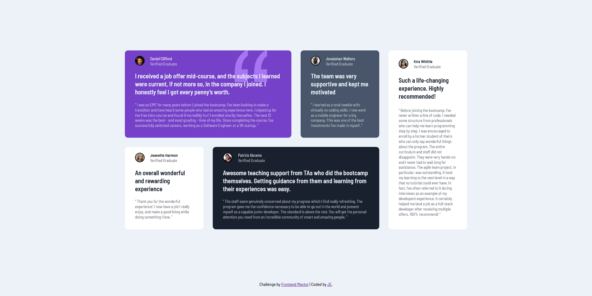

# Frontend Mentor - Testimonial Grid Solution

This is a solution to the [Testimonials grid challenge on Frontend Mentor](https://www.frontendmentor.io/challenges/testimonials-grid-section-Nnw6J7Un7).

## Overview

### The challenge

Your challenge is to build out this testimonials grid section and get it looking as close to the design as possible.

You can use any tools you like to help you complete the challenge. So if you've got something you'd like to practice, feel free to give it a go.

Users should be able to:

- View the optimal layout for the site depending on their device's screen size

### Screenshot

### Links

- Solution URL: [https://www.frontendmentor.io/solutions/scss-css-grid-flexbox-8xAkoiyu0](https://www.frontendmentor.io/solutions/scss-css-grid-flexbox-8xAkoiyu0)
- Live Site URL: [https://je-testimonials-grid.netlify.app](https://je-testimonials-grid.netlify.app/)

## Author

- Website - [Add your name here](https://www.your-site.com)
- Frontend Mentor - [@JECagurangan](https://www.frontendmentor.io/profile/JECagurangan)
- Facebook - [@Jeyihh](https://www.facebook.com/Jeyihh/)
