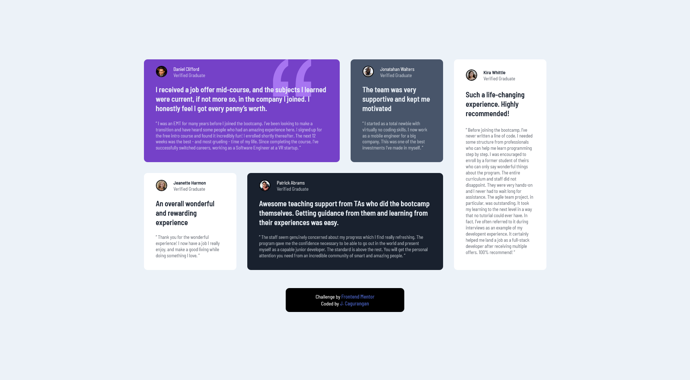

# Frontend Mentor - Testimonial Grid Solution

This is a solution to the [Testimonials grid challenge on Frontend Mentor](https://www.frontendmentor.io/challenges/testimonials-grid-section-Nnw6J7Un7).

## Table of contents

- [Overview](#overview)
  - [The challenge](#the-challenge)
  - [Screenshot](#screenshot)
  - [Links](#links)
- [My process](#my-process)
  - [Built with](#built-with)
  - [What I learned](#what-i-learned)
  - [Continued development](#continued-development)
  - [Useful resources](#useful-resources)
- [Author](#author)

## Overview

### The challenge

Your challenge is to build out this testimonials grid section and get it looking as close to the design as possible.

You can use any tools you like to help you complete the challenge. So if you've got something you'd like to practice, feel free to give it a go.

Users should be able to:

- View the optimal layout for the site depending on their device's screen size

### Screenshot



### Links

- Solution URL: [https://www.frontendmentor.io/solutions/scss-css-grid-flexbox-8xAkoiyu0](https://www.frontendmentor.io/solutions/scss-css-grid-flexbox-8xAkoiyu0)
- Live Site URL: [https://je-testimonials-grid.netlify.app](https://je-testimonials-grid.netlify.app/)

## My process

### Built with

- Semantic HTML5 markup
- CSS custom properties
- Flexbox
- CSS Grid
- Mobile-first workflow
- SCSS
- BEM Architecture

### What I learned

Use this section to recap over some of your major learnings while working through this project. Writing these out and providing code samples of areas you want to highlight is a great way to reinforce your own knowledge.

To see how you can add code snippets, see below:

```html
<h1>Some HTML code I'm proud of</h1>
```
```css
transition: height 0.5s ease-in-out;
```
```js
const shareButtonSVG = shareButton.childNodes[1];
const shareButtonPath = shareButtonSVG.childNodes[0];
```

## Author

- Website - [Add your name here](https://www.your-site.com)
- Frontend Mentor - [@JECagurangan](https://www.frontendmentor.io/profile/JECagurangan)
- Facebook - [@Jeyihh](https://www.facebook.com/Jeyihh/)

